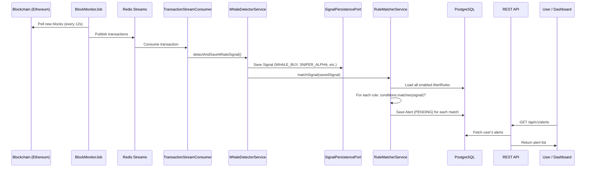

# Alert Rules System — Feature Walkthrough

> Implemented: Feb 26, 2026 · Branch: `feat/alert-rules`

---

## What Was Built

A real-time alert rules engine that lets users define custom rules and automatically generates alerts when detected blockchain signals match those rules. This completes the **detect → match → alert** pipeline.

---

## End-to-End Workflow



### Step-by-Step

1. **Block detected** → `BlockMonitorJob` polls Ethereum every 12s
2. **Transaction published** → Pushed to Redis Streams
3. **Transaction consumed** → `TransactionStreamConsumer` reads from stream
4. **Signal detected** → `WhaleDetectorService.detectAndSaveWhaleSignal()` creates and saves a `Signal` (e.g., `WHALE_BUY` for $150K)
5. **Rules matched** → `RuleMatcherService.matchSignal(signal)` loads all enabled `AlertRule`s and tests each one's `AlertConditions.matches(signal)`
6. **Alert created** → For each matching rule, an `Alert` with status `PENDING` is saved to the `alerts` table
7. **User queries** → Dashboard calls `GET /api/v1/alerts` to show the user their triggered alerts

---

## API Endpoints

### Alert Rules (CRUD)

| Method | Endpoint | Description |
|--------|----------|-------------|
| `POST` | `/api/v1/alert-rules` | Create a new rule |
| `GET` | `/api/v1/alert-rules` | List user's rules |
| `GET` | `/api/v1/alert-rules/{id}` | Get single rule |
| `PUT` | `/api/v1/alert-rules/{id}` | Update a rule |
| `DELETE` | `/api/v1/alert-rules/{id}` | Delete a rule |

**Example — Create a rule:**
```bash
curl -X POST http://localhost:8080/api/v1/alert-rules \
  -H "Authorization: Bearer <JWT>" \
  -H "Content-Type: application/json" \
  -d '{
    "name": "Whale Buys >100K",
    "conditions": {
      "signalTypes": ["WHALE_BUY", "SNIPER_ALPHA"],
      "minAmountUsd": 100000,
      "chains": ["ethereum"]
    },
    "channels": ["in_app"],
    "enabled": true
  }'
```

**Response (201 Created):**
```json
{
  "id": "a1b2c3d4-...",
  "userId": "f5e6d7c8-...",
  "name": "Whale Buys >100K",
  "conditions": {
    "signalTypes": ["WHALE_BUY", "SNIPER_ALPHA"],
    "minAmountUsd": 100000,
    "chains": ["ethereum"]
  },
  "channels": ["in_app"],
  "enabled": true,
  "createdAt": "2026-02-26T16:00:00",
  "updatedAt": "2026-02-26T16:00:00"
}
```

### Alerts (Read-only)

| Method | Endpoint | Description |
|--------|----------|-------------|
| `GET` | `/api/v1/alerts?limit=50` | List triggered alerts |
| `PATCH` | `/api/v1/alerts/{id}/read` | Mark alert as read |
| `GET` | `/api/v1/alerts/unread-count` | Get unread count |

**Example — Get unread count:**
```bash
curl http://localhost:8080/api/v1/alerts/unread-count \
  -H "Authorization: Bearer <JWT>"
```

**Response:**
```json
{ "unreadCount": 7 }
```

---

## Matching Logic (`AlertConditions.matches`)

All conditions are **AND-combined**. Null/empty = no filter (match everything).

| Condition | Type | Behavior |
|-----------|------|----------|
| `signalTypes` | `List<String>` | Signal type must be in the list |
| `minAmountUsd` | `BigDecimal` | Signal USD value must be ≥ threshold |
| `chains` | `List<String>` | Signal chain must be in list (case-insensitive) |
| `tokenAddresses` | `List<String>` | Signal token address must be in list (case-insensitive) |
| `walletArchetypes` | `List<String>` | Reserved for future use |

---

## Files Changed (31 total)

### New Files (27)

| Layer | File |
|-------|------|
| Domain Model | `Alert.java`, `AlertConditions.java`, `AlertRule.java` |
| Port | `AlertPersistencePort.java`, `AlertRulePersistencePort.java` |
| Service | `AlertRuleService.java`, `AlertService.java`, `RuleMatcherService.java` |
| Entity | `AlertEntity.java`, `AlertRuleEntity.java` |
| Repository | `AlertRepository.java`, `AlertRuleRepository.java` |
| Adapter | `AlertPersistenceAdapter.java`, `AlertRulePersistenceAdapter.java` |
| Controller | `AlertController.java`, `AlertRuleController.java` |
| DTO | `AlertRuleRequest.java`, `AlertRuleResponse.java`, `AlertResponse.java`, `UnreadCountResponse.java` |
| Exception | `AlertRuleNotFoundException.java`, `AlertNotFoundException.java` |
| Migration | `V21__create_alerts_table.sql` |
| Test | `AlertConditionsTest.java`, `RuleMatcherServiceTest.java`, `AlertRuleControllerTest.java`, `AlertControllerTest.java` |

### Modified Files (4)

| File | Change |
|------|--------|
| `DomainServiceConfig.java` | Added `alertRuleService`, `ruleMatcherService`, `alertService` beans; `WhaleDetectorService` now takes `RuleMatcherService` |
| `GlobalExceptionHandler.java` | Consolidated all `DomainException` handlers into a single generic handler |
| `DomainException.java` | Minor modification to support consolidated handler |
| `WhaleDetectorService.java` | Added `ruleMatcherService.matchSignal(saved)` call after saving signal |

---

## What's Next

The alerts are created with status `PENDING` but not delivered anywhere yet. Next feature:

**Telegram Bot Integration** — pick up `PENDING` alerts and deliver them as formatted Telegram messages to users who have linked their `telegramChatId`.
