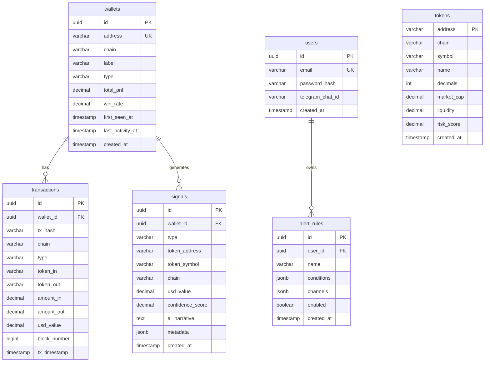

# Argus - Database Schema

## Entity Relationship Diagram

---

## Tables

| Table | Purpose |
|-------|---------|
| `wallets` | Tracked blockchain addresses |
| `tokens` | Token metadata (symbol, liquidity) |
| `transactions` | Wallet activity history |
| `signals` | Detected trading signals |
| `users` | Application users |
| `alert_rules` | User notification rules |

---

## Relationships

| From | To | Type |
|------|----|------|
| `wallets` | `transactions` | 1:N |
| `wallets` | `signals` | 1:N |
| `users` | `alert_rules` | 1:N |

---

## Indexes

| Table | Index | Columns |
|-------|-------|---------|
| wallets | idx_wallets_address | address |
| wallets | idx_wallets_type | type |
| transactions | idx_transactions_wallet | wallet_id |
| transactions | idx_transactions_timestamp | tx_timestamp |
| signals | idx_signals_type | type |
| signals | idx_signals_created | created_at |
