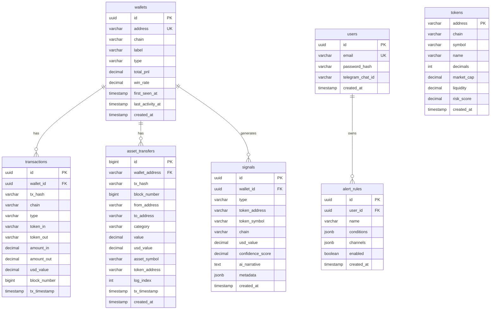

# Argus - Database Schema

> **Last Updated**: 2026-01-09

## Visual Overview

```
┌─────────────────────────────────────────────────────────────────────────────┐
│                              ARGUS DATABASE                                  │
└─────────────────────────────────────────────────────────────────────────────┘

                    ┌─────────────┐
                    │   users     │
                    │ ─────────── │
                    │ id (PK)     │
                    │ email       │
                    │ telegram_id │
                    └──────┬──────┘
                           │ 1:N
                           ▼
                    ┌─────────────┐
                    │ alert_rules │
                    └─────────────┘

┌─────────────────────────────────────────────────────────────────────────────┐
│                           BLOCKCHAIN TRACKING                                │
└─────────────────────────────────────────────────────────────────────────────┘

                              ┌──────────────────┐
                              │     wallets      │
                              │ ──────────────── │
                              │ id (PK)          │
                              │ address (UK)     │
                              │ type, label      │
                              │ total_pnl        │
                              └────────┬─────────┘
                                       │
              ┌────────────────────────┼────────────────────────┐
              │                        │                        │
              ▼ 1:N                    ▼ 1:N                    ▼ 1:N
    ┌─────────────────┐      ┌─────────────────┐      ┌─────────────────┐
    │  transactions   │      │ asset_transfers │      │    signals      │
    │ ─────────────── │      │ ─────────────── │      │ ─────────────── │
    │ tx_hash         │      │ tx_hash         │      │ type            │
    │ from, to        │      │ wallet_address  │      │ token_address   │
    │ value, input    │      │ from, to        │      │ confidence      │
    │ usd_value       │      │ value           │      │ ai_narrative    │
    │                 │      │ usd_value ←NEW  │      │                 │
    │                 │      │ asset_symbol    │      │                 │
    └─────────────────┘      └─────────────────┘      └─────────────────┘
         Raw TXs              Alchemy Transfers         Trading Signals

                              ┌──────────────────┐
                              │     tokens       │
                              │ ──────────────── │
                              │ address (PK)     │
                              │ symbol, name     │
                              │ liquidity        │
                              │ risk_score       │
                              └──────────────────┘
                                  Token Metadata
```

---

## Entity Relationship Diagram


```mermaid
erDiagram
    wallets ||--o{ transactions : has
    wallets ||--o{ asset_transfers : has
    wallets ||--o{ signals : generates
    users ||--o{ alert_rules : owns

    wallets {
        uuid id PK
        varchar address UK
        varchar chain
        varchar label
        varchar type
        decimal total_pnl
        decimal win_rate
        timestamp first_seen_at
        timestamp last_activity_at
        timestamp created_at
    }

    tokens {
        varchar address PK
        varchar chain
        varchar symbol
        varchar name
        int decimals
        decimal market_cap
        decimal liquidity
        decimal risk_score
        timestamp created_at
    }

    transactions {
        uuid id PK
        uuid wallet_id FK
        varchar tx_hash
        varchar chain
        varchar type
        varchar token_in
        varchar token_out
        decimal amount_in
        decimal amount_out
        decimal usd_value
        bigint block_number
        timestamp tx_timestamp
    }

    asset_transfers {
        bigint id PK
        varchar wallet_address FK
        varchar tx_hash
        bigint block_number
        varchar from_address
        varchar to_address
        varchar category
        decimal value
        decimal usd_value
        varchar asset_symbol
        varchar token_address
        int log_index
        timestamp tx_timestamp
        timestamp created_at
    }

    signals {
        uuid id PK
        uuid wallet_id FK
        varchar type
        varchar token_address
        varchar token_symbol
        varchar chain
        decimal usd_value
        decimal confidence_score
        text ai_narrative
        jsonb metadata
        timestamp created_at
    }

    users {
        uuid id PK
        varchar email UK
        varchar password_hash
        varchar telegram_chat_id
        timestamp created_at
    }

    alert_rules {
        uuid id PK
        uuid user_id FK
        varchar name
        jsonb conditions
        jsonb channels
        boolean enabled
        timestamp created_at
    }
```

---

## Tables

| Table | Purpose | Migration |
|-------|---------|-----------|
| `wallets` | Tracked blockchain addresses | V1 |
| `tokens` | Token metadata (symbol, liquidity) | V2 |
| `transactions` | Raw blockchain transactions | V3 |
| `signals` | Detected trading signals | V4 |
| `users` | Application users | V5 |
| `alert_rules` | User notification rules | - |
| `asset_transfers` | Normalized wallet transfers (Alchemy) | V6, V10 |

---

## Relationships

| From | To | Type |
|------|----|------|
| `wallets` | `transactions` | 1:N |
| `wallets` | `asset_transfers` | 1:N (via wallet_address) |
| `wallets` | `signals` | 1:N |
| `users` | `alert_rules` | 1:N |

---

## Indexes

| Table | Index | Columns |
|-------|-------|---------|
| wallets | idx_wallets_address | address |
| wallets | idx_wallets_type | type |
| transactions | idx_transactions_wallet | wallet_id |
| transactions | idx_transactions_timestamp | tx_timestamp |
| signals | idx_signals_type | type |
| signals | idx_signals_created | created_at |
| asset_transfers | idx_wallet_address | wallet_address |
| asset_transfers | idx_tx_timestamp | tx_timestamp |
| asset_transfers | idx_tx_hash | tx_hash |

---

## Constraints

| Table | Constraint | Columns | Purpose |
|-------|------------|---------|---------|
| asset_transfers | uq_asset_transfer | tx_hash, wallet_address, category, log_index | Prevent duplicate transfers |

